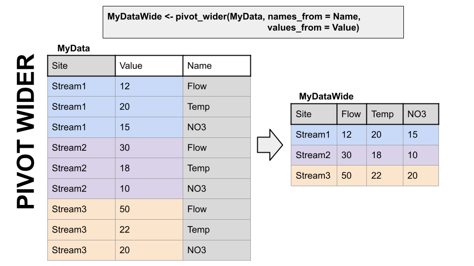

```{r setup, include=FALSE}
knitr::opts_chunk$set(echo = TRUE)
```

Load the tidyverse library.

```{r}

```

Run the two lines below.

Create a dataset called "pines_long" and filter it to just the seeds in the seeds vector below.

Output pines_long below the chunk. Is this a good way to look at a table of these data?

```{r}
Loblolly <- Loblolly

seeds <- c("301", "303", "305", "307", "309")
```

Let's think about the best way to show these data as a table.

A two-dimensional object can be either long or wide. Each has it's advantages.

**LONG**

Each observation has it's own row. In the first image below, the table on the right because each measurement of "value" has it's own row. What that value is a measure of is on the far right.

**WIDE**

Observations of different things have their own columns. In the first image below, the table on the left is wide. Many columns have data in them, each measure has its own column.

**Why?**

Long and wide data are more efficient for different things. Think about plotting a data set with 10 stream gages. If they are in a long format, you can just add color = Gage to your ggplot aes(). If they are in a wide format, meaning each gage has it's own column, you'd have to write a new geom for EACH gage, because they're all in separate columns.

Now imagine you want to do some math to create new data: let's say NO3 divided by flow in long data.... How would you even do that? With the wide data on the left it is simply mutate(NO3perflow = NO3 / Flow).

Finally, which table is easier to read in TABLE format (not a plot) in each of the two images below? Wide data is much more fitting for tables.




dplyr, part of the tidyverse, has functions to convert data between wide and long data. I have to look up the syntax every single time I use them. But they are VERY useful.

Using the syntax above, let's make the pines_long data WIDE using pivot_wider.

Which values to you want to be column names?

Which values to you want to be in the value column?

Output pines_wide at the end of the chunk. Is this a better way to look at the table?

```{r}

```

Create a new column in pines_wide called T301_303 and make it equal to the 301 column minus the 303 column. You have to reference these as with back-ticks around the column names since column names aren't supposed to be numbers.

How would you do this with pines_long?

```{r}

```

Read the data file McDonald data example csv.

```{r}

```

We want to create the "McD_chem.png" plot in your files tab. Open the image and look at it. We could do this with the data in the format in the csv, but it is much easier if it is in long format.

Use pivot_longer() to pivot the McDonald data long.

```{r}

```

In the chunk below, reproduce the McD_chem.png plot as accurately as possible.

```{r}

```

Knit this rmd and submit on canvas as an html or pdf!
